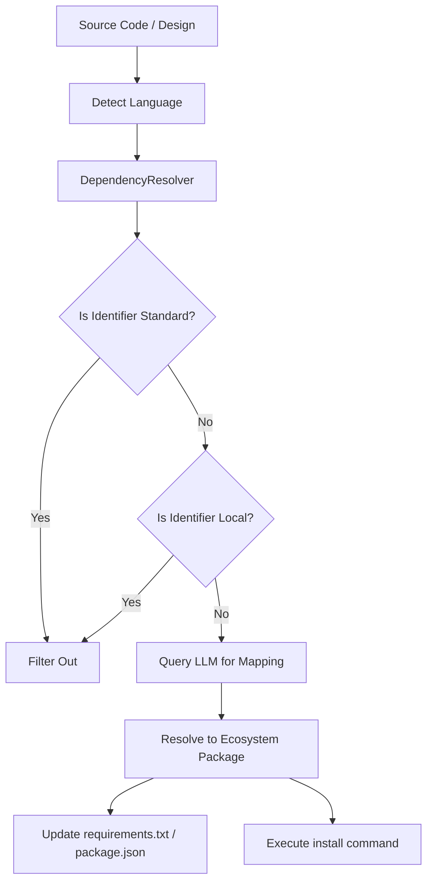

# RAICA Dependency Resolution Architecture

## Overview

The RAICA Dependency Resolution system provides a dynamic, LLM-driven mechanism for mapping code-level identifiers (imports, requires, uses) to their corresponding package manager names (pip, npm, cargo, etc.). This architecture ensures accurate dependency management across multiple programming languages without brittle, hardcoded mapping tables.

---

## 1. Context & Rationale

### The Problem

Traditional dependency management in AI agents often fails due to:

- **Import/Package Disconnect**: Modules like `gi` requiring `PyGObject` or `cv2` requiring `opencv-python`.
- **Language Specificity**: Most systems are hardcoded for Python only.
- **Brittle Mappings**: Hardcoded dictionaries quickly become outdated or incomplete.

### The Solution

A centralized, language-agnostic `DependencyResolver` service that leverages the LLM's knowledge as a "live heuristic" to perform mappings at runtime based on the detected project language.

---

## 2. Architecture Components

### 2.1 DependencyResolver Service

**Location:** [dependency_resolver.py](file:///home/sabawi/Development/RAICA/agents/coding_agent/services/dependency_resolver.py)

The core engine responsible for:

- **Language Detection**: Automatically identifying the project's primary language (Python, JavaScript, Go, Rust) by scanning file extensions.
- **OS & Distro Awareness**: Detects the host distribution (via `/etc/os-release`) to provide precise context for system package managers.
- **Multi-Language Scanning**: Using language-specific regex patterns to extract dependency identifiers from source code.
- **LLM Heuristics**: Prompting the LLM with language context and OS info to resolve identifiers into actual package names.
- **System-Level Resolution**: Analyzing failed installation output via LLM to identify missing system headers or libraries, with explicit instructions to account for version-specific jumps (e.g., Ubuntu 24.04).
- **Internet Research Capability**: Integrated `web_search` for resolving ambiguous package names. If the LLM is unsure of a package name for a specific OS version, it returns search queries which the orchestrator executes to refine the resolution.
- **Dynamic Filtering**: Filtering out standard library modules and internal project files based on language-specific rules.

### 2.2 Integration: Coding Agent Lifecycle

**Location:** [cli_coding_agent.py](file:///home/sabawi/Development/RAICA/agents/coding_agent/cli_coding_agent.py)

Dependency resolution is integrated into the coding pipeline:

1. **Design Phase**: The LLM identifies "External Dependencies" during architecture.
2. **Post-Coding Reconciliation**: After code generation, the `DependencyResolver` performs a "Ground Truth" scan. It parses all generated files to find actual imports/requires and reconciles them with the designed dependencies to produce a final, verified dependency file (e.g., `requirements.txt`).

### 2.3 Integration: Debug Orchestrator

**Location:** [debug_orchestrator.py](file:///home/sabawi/Development/RAICA/agents/coding_agent/services/debug_orchestrator.py)

When an `ImportError` or equivalent is encountered during debugging:

1. **Detection**: The orchestrator catches the missing module/package error.
2. **Resolution**: Calls `DependencyResolver.resolve_packages([X], language=lang)`.
3. **Execution**: Performs installation using the correct package manager.
4. **Persistence**: Triggers a dependency file update (e.g., `requirements.txt`) so the fix is permanent.
5. **Research Flow**: If the system dependency is unknown, it triggers a `search_web` task to find the current correct package for the detected OS version.

### 2.4 Integration: Environment Safety Guards

**Locations:** [tool_executor.py](file:///home/sabawi/Development/RAICA/agents/coding_agent/services/tool_executor.py), [generalized_debug_engine.py](file:///home/sabawi/Development/RAICA/agents/coding_agent/services/generalized_debug_engine.py)

To prevent the agent from accidentally modifying the virtual environment or git metadata during a debug loop:

- **Path Blocking**: All file modification tools (write, edit, delete, rename) are blocked if the target path contains `venv/`, `.venv/`, or `.git/`.
- **Intelligent Feedback**: When a modification is blocked, the agent receives a `Permission Denied` error, guiding it to modify project files (like `requirements.txt`) rather than the environment itself.

---

## 3. Data Flow

---

## 4. Debugging & Maintenance

### Common Issues

- **Extension Conflicts**: In projects with mixed languages, the resolver prioritizes the most prevalent extension.
- **LLM Hallucinations**: Handled by catching installation failures and allowing the agent to report the blockage.

### Extending

To add a new language, simply:

1. Add the file extension to `detect_language`.
2. Add the extraction regex to `extract_dependencies_from_files`.
3. Update the package manager mapping in `resolve_packages`.
