# RAGG Debugger - High-Level Design Document (HLD)

**Version:** 1.0  
**Document Type:** High-Level Design (HLD)  
**Project:** Language-Agnostic Code Intelligence, Refactoring & LLM-Assisted Debugging Engine  
**Date:** 2026-01-18  
**Authors:** Senior Engineering Team

---

## Table of Contents

1. [Executive Summary](#1-executive-summary)
2. [System Vision & Goals](#2-system-vision--goals)
3. [Architectural Overview](#3-architectural-overview)
4. [Component Architecture](#4-component-architecture)
5. [Data Architecture](#5-data-architecture)
6. [Integration Architecture](#6-integration-architecture)
7. [Technology Stack](#7-technology-stack)
8. [Quality Attributes](#8-quality-attributes)
9. [Security Considerations](#9-security-considerations)
10. [Deployment Architecture](#10-deployment-architecture)
11. [Risk Assessment](#11-risk-assessment)
12. [Appendices](#12-appendices)

---

## 1. Executive Summary

### 1.1 Purpose

The RAGG Debugger is a **local-first, high-performance static analysis engine** that transforms polyglot source code into a queryable **Semantic Knowledge Graph**. This graph serves as the foundation for:

- **Deterministic Tooling:** Code navigation, safe refactoring, linting, and dead code detection
- **Probabilistic Tooling:** RAG-backed context generation for LLMs to minimize hallucination during debugging and code generation tasks

### 1.2 Key Differentiators

| Aspect                 | Traditional IDEs             | RAGG Debugger                   |
| ---------------------- | ---------------------------- | ------------------------------- |
| **Language Support**   | Language-specific plugins    | Unified IR across all languages |
| **Analysis Scope**     | Single-file or project-local | Cross-project semantic analysis |
| **LLM Integration**    | Token-stuffing approaches    | Optimized semantic slicing      |
| **Refactoring Safety** | Heuristic-based              | Graph-proven correctness        |

### 1.3 Scope Boundaries

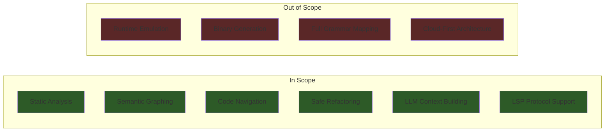

---

## 2. System Vision & Goals

### 2.1 Vision Statement

> **"Transform any codebase into a queryable knowledge graph that enables both deterministic tooling and intelligent LLM-assisted development, operating entirely on local infrastructure."**

### 2.2 Primary Goals

| ID  | Goal                           | Success Metric                                            |
| --- | ------------------------------ | --------------------------------------------------------- |
| G1  | **Language Agnostic Analysis** | Support 10+ languages through unified adapter pattern     |
| G2  | **Sub-second Query Response**  | P95 latency < 100ms for navigation queries                |
| G3  | **Incremental Processing**     | Re-index only changed files, < 2s for typical edits       |
| G4  | **LLM Context Optimization**   | Generate semantically-optimal context within token budget |
| G5  | **Safe Refactoring**           | Zero false-positive refactoring proposals                 |

### 2.3 Architectural Principles

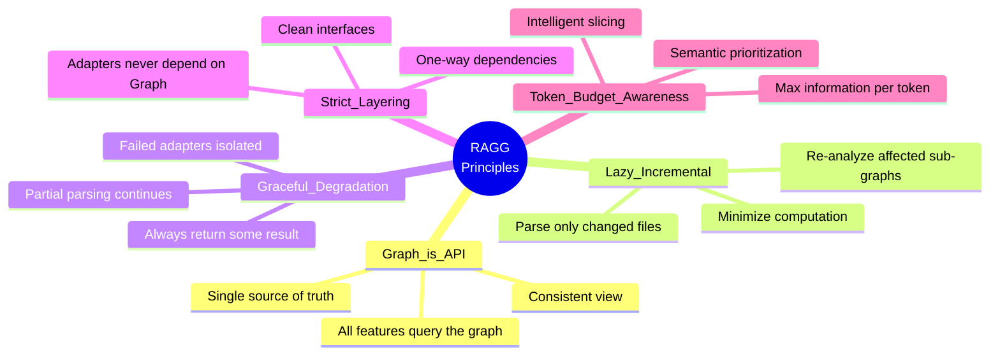

---

## 3. Architectural Overview

### 3.1 System Context Diagram (C4 Level 1)

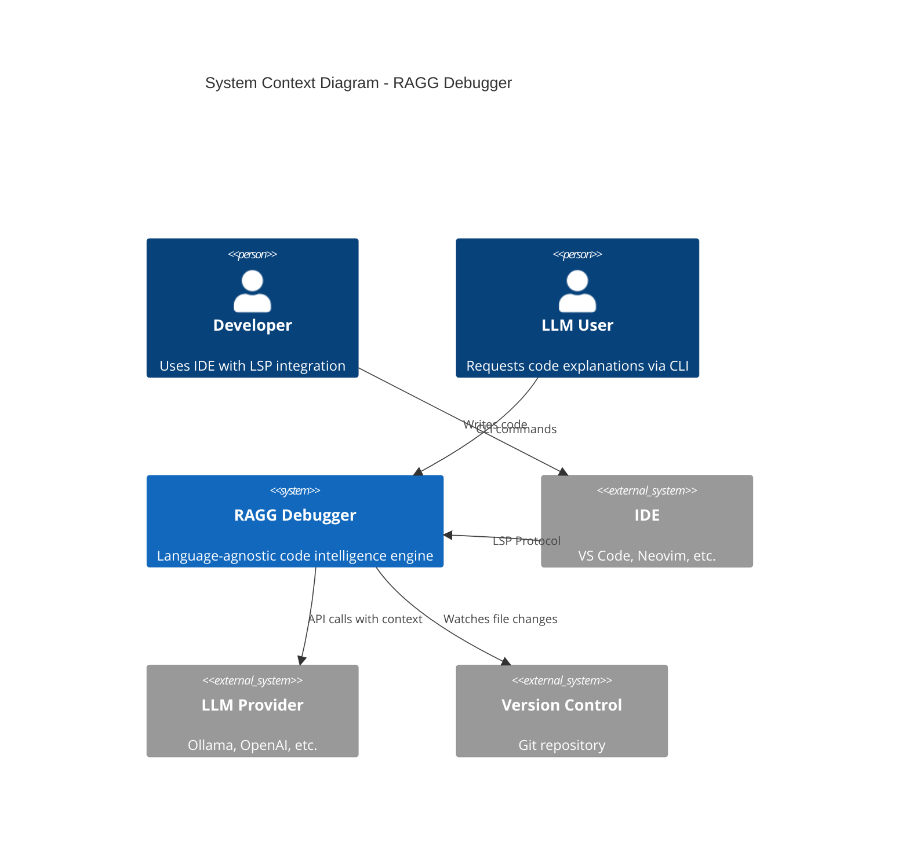

### 3.2 Container Diagram (C4 Level 2)

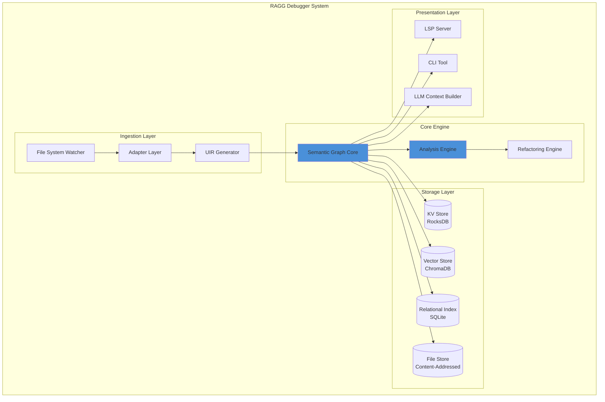

### 3.3 High-Level Data Flow

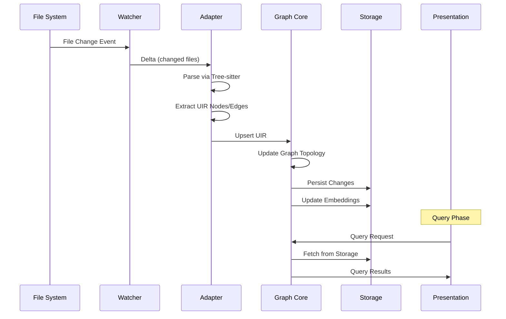

---

## 4. Component Architecture

### 4.1 Component Overview

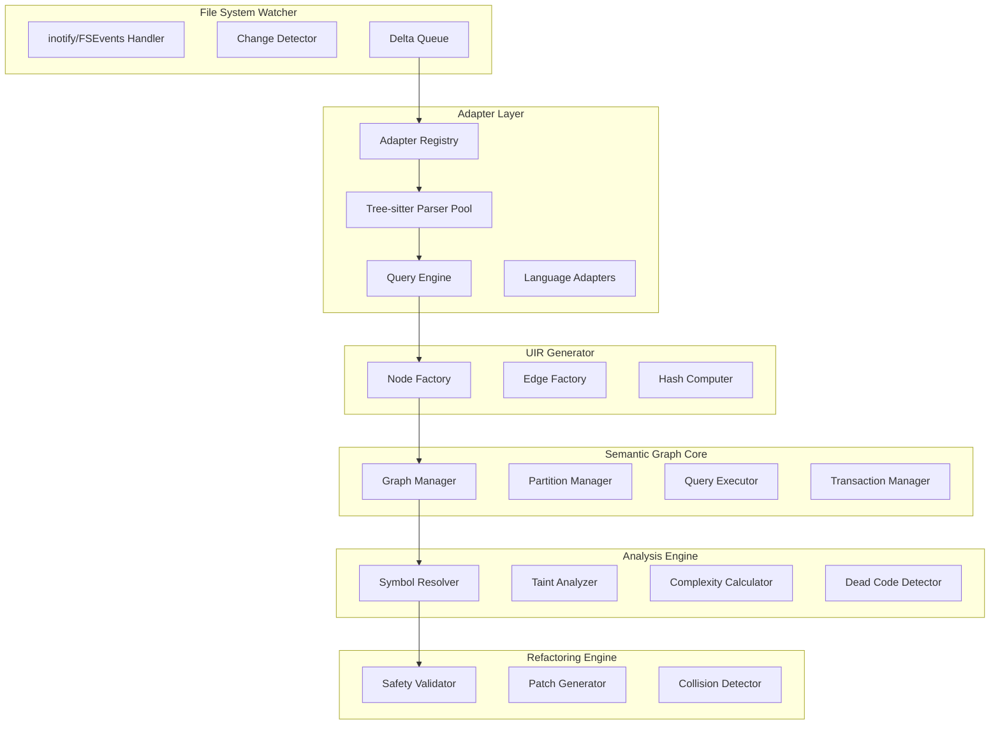

### 4.2 Component Responsibilities

| Component               | Primary Responsibility                        | Key Interfaces                   |
| ----------------------- | --------------------------------------------- | -------------------------------- |
| **File System Watcher** | Detect file changes, compute deltas           | `ChangeEvent`, `DeltaQueue`      |
| **Adapter Layer**       | Language-specific parsing to universal format | `LanguageAdapter`, `Parser`      |
| **UIR Generator**       | Create normalized intermediate representation | `UIRNode`, `UIREdge`             |
| **Semantic Graph Core** | Maintain and query the knowledge graph        | `GraphQuery`, `Transaction`      |
| **Analysis Engine**     | Static analysis passes over graph             | `AnalysisPass`, `AnalysisResult` |
| **Refactoring Engine**  | Safe code transformations                     | `RefactorRequest`, `Patch`       |
| **LLM Context Builder** | Optimize context for LLM consumption          | `ContextSlice`, `PromptBuilder`  |
| **LSP Server**          | IDE protocol implementation                   | JSON-RPC over stdio/TCP          |
| **CLI Tool**            | Command-line interface                        | Shell commands                   |

### 4.3 Graph Partition Strategy

The Semantic Graph is logically partitioned for query optimization:

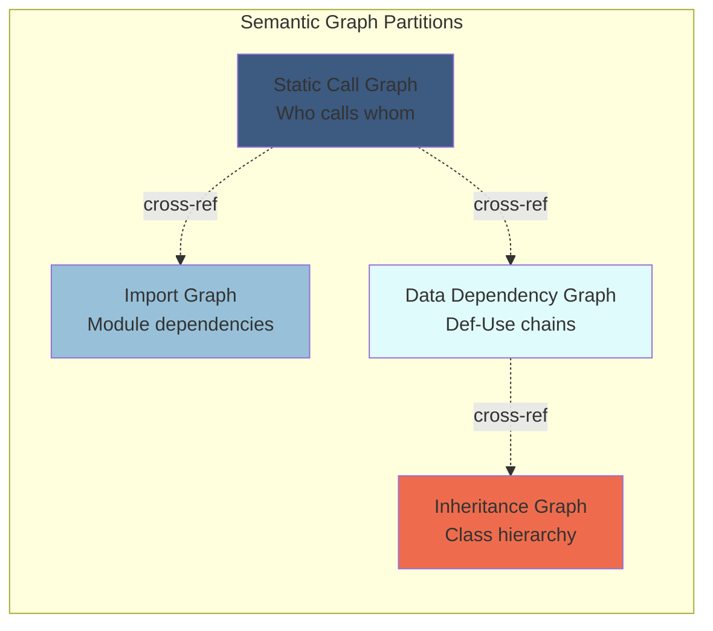

---

## 5. Data Architecture

### 5.1 Data Model Overview

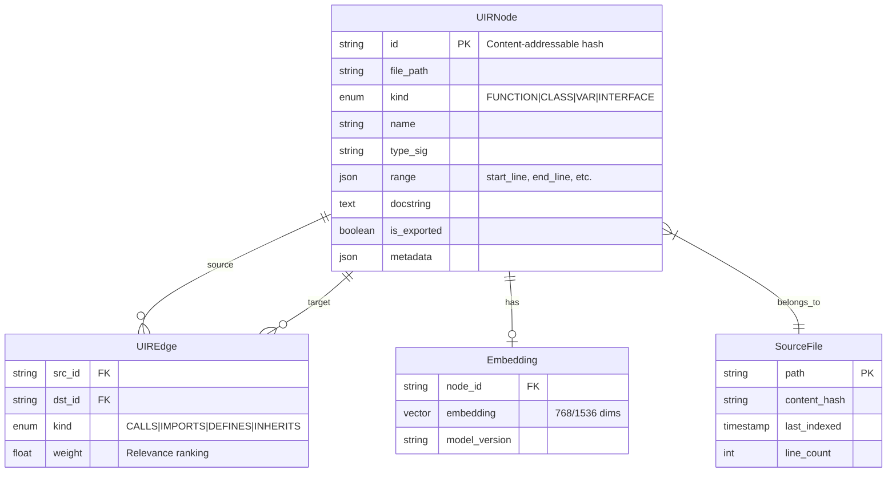

### 5.2 Storage Layer Distribution

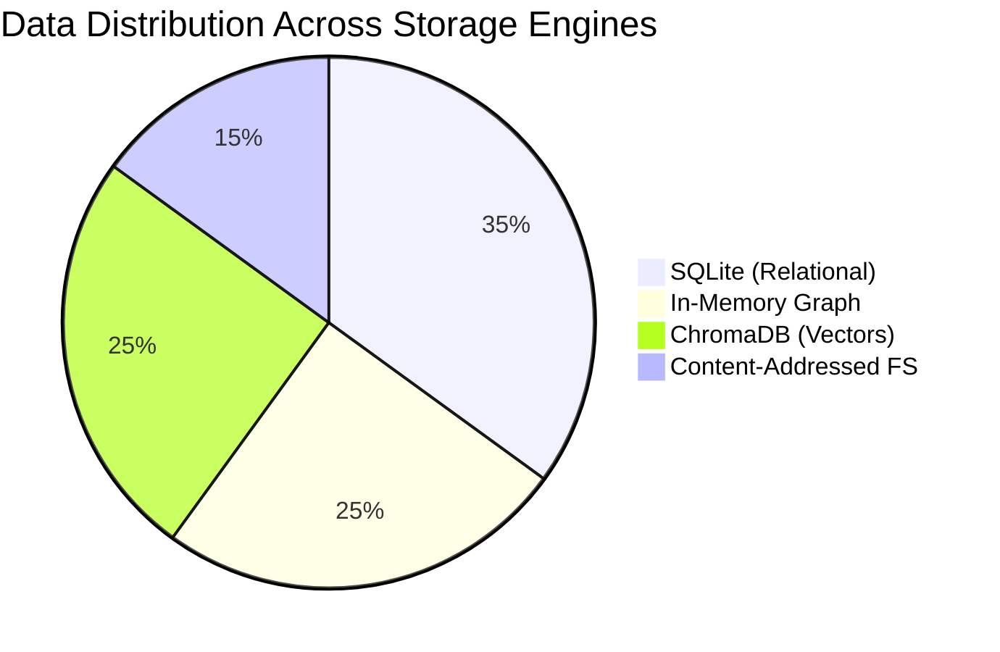

### 5.3 Hybrid Storage Strategy

| Data Category           | Storage Engine                | Access Pattern                     | Consistency |
| ----------------------- | ----------------------------- | ---------------------------------- | ----------- |
| **Node/Edge Metadata**  | SQLite                        | Random access by ID, range queries | Strong      |
| **Graph Topology**      | In-Memory (NetworkX/Petgraph) | Traversal, path finding            | Eventual    |
| **Semantic Embeddings** | ChromaDB/Faiss                | Vector similarity search           | Eventual    |
| **Source Blobs**        | Content-Addressed Files       | Version-agnostic retrieval         | Strong      |
| **File Hash Map**       | SQLite                        | Incremental change detection       | Strong      |

---

## 6. Integration Architecture

### 6.1 External Integration Points

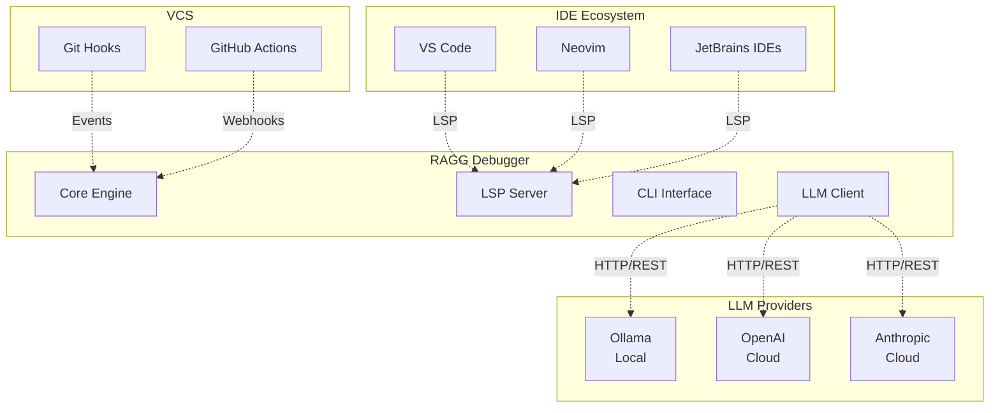

### 6.2 LSP Protocol Support

| LSP Method                | RAGG Implementation                            |
| ------------------------- | ---------------------------------------------- |
| `textDocument/definition` | Query Graph for `DEFINES` edge                 |
| `textDocument/references` | Query Graph for incoming `USES` edges          |
| `textDocument/rename`     | Trigger Refactoring Engine with safety checks  |
| `textDocument/hover`      | Return inferred type + docstring + LLM summary |
| `textDocument/completion` | Scope-aware symbol completion from graph       |
| `textDocument/codeAction` | Refactoring suggestions from Analysis Engine   |

### 6.3 LLM Integration Flow

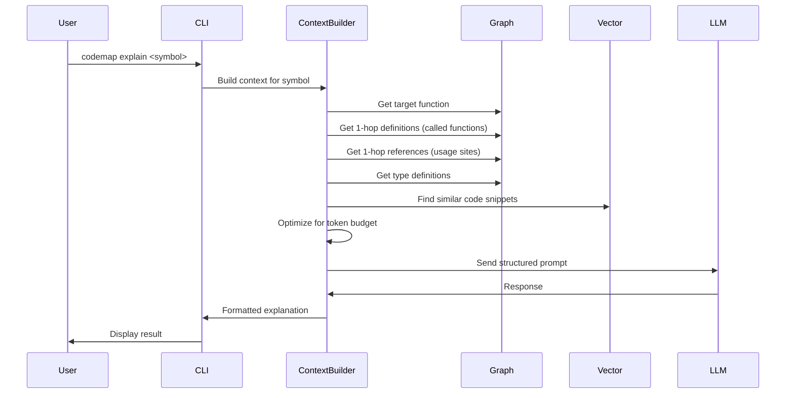

---

## 7. Technology Stack

### 7.1 Core Technology Decisions

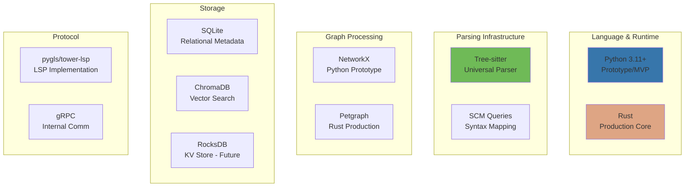

### 7.2 Technology Justification

| Component         | Choice              | Rationale                                | Alternatives Considered                   |
| ----------------- | ------------------- | ---------------------------------------- | ----------------------------------------- |
| **Parser**        | Tree-sitter         | Universal, incremental, battle-tested    | ANTLR (heavier), Custom (expensive)       |
| **Graph Library** | NetworkX → Petgraph | Fast iteration → Production perf         | Neo4j (heavyweight), DGraph (distributed) |
| **Relational DB** | SQLite              | Embedded, ACID, sufficient for 500k+ LOC | PostgreSQL (overkill), MySQL (overkill)   |
| **Vector Store**  | ChromaDB            | Python-native, simple API, good perf     | Faiss (lower-level), Pinecone (cloud)     |
| **LSP Framework** | pygls (Python)      | Mature, well-documented                  | tower-lsp (Rust - production)             |
| **Language**      | Python → Rust       | Prototype speed → Production performance | Go (less ecosystem), C++ (complexity)     |

### 7.3 Dependency Management

```yaml
# Core Dependencies (Python Prototype)
core:
  - tree_sitter >= 0.21.0 # Universal parser
  - tree_sitter_languages >= 1.8 # Pre-built grammars
  - networkx >= 3.2 # Graph data structure
  - chromadb >= 0.4.0 # Vector store
  - pygls >= 1.3.0 # LSP implementation
  - sqlalchemy >= 2.0 # Database ORM
  - pydantic >= 2.5 # Data validation
  - click >= 8.1 # CLI framework
  - watchdog >= 4.0 # File system events

analysis:
  - sentence_transformers >= 2.2 # Code embeddings

optional:
  - ollama >= 0.1.0 # Local LLM client
  - openai >= 1.0 # Cloud LLM client
```

---

## 8. Quality Attributes

### 8.1 Performance Requirements

| Metric                 | Target               | Measurement               |
| ---------------------- | -------------------- | ------------------------- |
| **Initial Index Time** | < 30s for 100k LOC   | Wall clock time           |
| **Incremental Update** | < 2s per file change | Hot path latency          |
| **Navigation Query**   | P95 < 100ms          | End-to-end LSP response   |
| **LLM Context Build**  | < 500ms              | Semantic slice generation |
| **Memory Footprint**   | < 2GB for 500k LOC   | RSS measurement           |

### 8.2 Scalability Targets

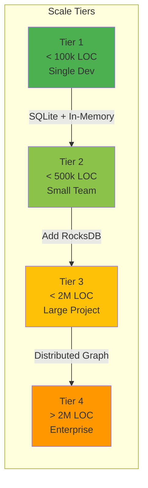

### 8.3 Reliability & Fault Tolerance

| Scenario            | Handling Strategy                         |
| ------------------- | ----------------------------------------- |
| **Parse Failure**   | Graceful degradation - index rest of file |
| **Corrupted Index** | Automatic rebuild from source             |
| **Storage Full**    | LRU eviction for embeddings, reject new   |
| **LLM Timeout**     | Fallback to cached/static response        |
| **Crash Recovery**  | WAL-based SQLite persistence              |

---

## 9. Security Considerations

### 9.1 Security Boundaries

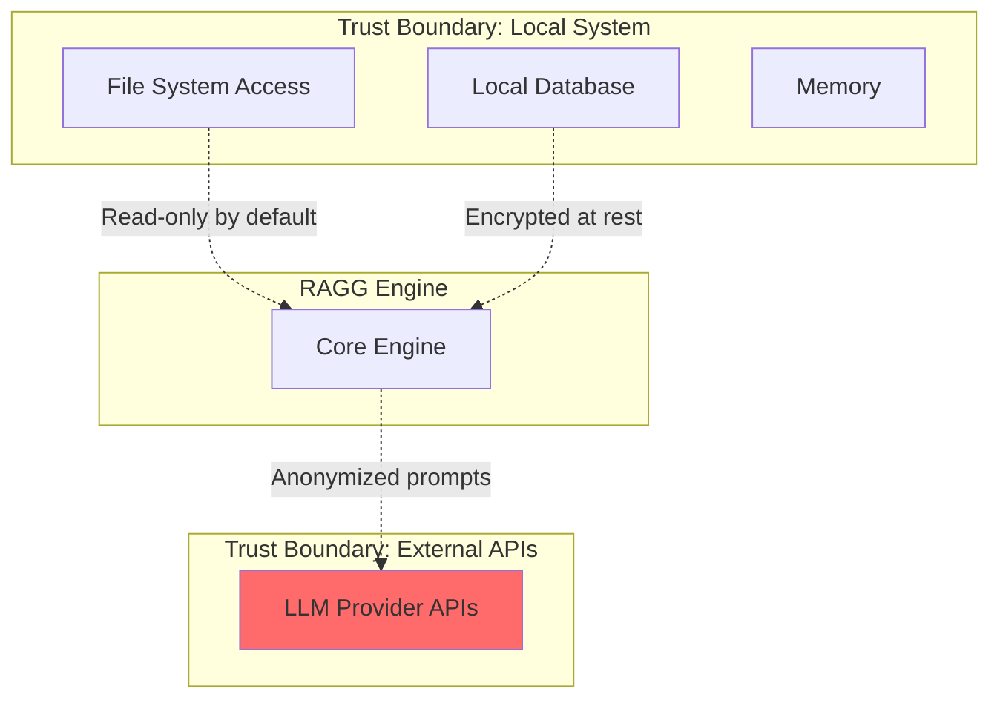

### 9.2 Security Requirements

| Requirement               | Implementation                             |
| ------------------------- | ------------------------------------------ |
| **No Code Execution**     | Static analysis only, no `eval()`          |
| **Local-First**           | All processing on user's machine           |
| **API Key Management**    | System keychain integration                |
| **LLM Data Sanitization** | Strip secrets before sending to cloud LLMs |
| **Audit Logging**         | Optional logging for enterprise compliance |

---

## 10. Deployment Architecture

### 10.1 Deployment Models

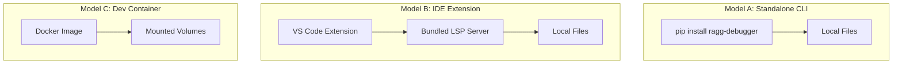

### 10.2 Distribution Strategy

| Distribution Channel    | Package Format | Update Mechanism      |
| ----------------------- | -------------- | --------------------- |
| **PyPI**                | Wheel          | pip upgrade           |
| **VS Code Marketplace** | VSIX           | Extension auto-update |
| **Homebrew**            | Formula        | brew upgrade          |
| **Docker Hub**          | Image          | docker pull           |
| **GitHub Releases**     | Binary/Source  | Manual download       |

---

## 11. Risk Assessment

### 11.1 Technical Risks

| Risk                         | Probability | Impact | Mitigation             |
| ---------------------------- | ----------- | ------ | ---------------------- |
| Tree-sitter grammar gaps     | Medium      | High   | Custom query fallbacks |
| NetworkX performance ceiling | High        | Medium | Planned Rust migration |
| LLM API rate limiting        | Medium      | Low    | Local Ollama default   |
| Embedding model drift        | Low         | Medium | Versioned embeddings   |

### 11.2 Operational Risks

| Risk                       | Probability | Impact | Mitigation                |
| -------------------------- | ----------- | ------ | ------------------------- |
| Large monorepo performance | Medium      | High   | Incremental indexing      |
| Disk space exhaustion      | Low         | Medium | Configurable cache limits |
| Memory pressure            | Medium      | Medium | Streaming analysis        |

---

## 12. Appendices

### A. Glossary

| Term    | Definition                                                      |
| ------- | --------------------------------------------------------------- |
| **UIR** | Unified Intermediate Representation - normalized code structure |
| **SCG** | Static Call Graph - function call relationships                 |
| **DDG** | Data Dependency Graph - variable usage patterns                 |
| **LSP** | Language Server Protocol - IDE communication standard           |
| **RAG** | Retrieval-Augmented Generation - context-aware LLM prompting    |

### B. Referenced Documents

- [ragg_debugger_architecure.md](file:///home/sabawi/Development/RAICA/ragg_debugger_architecure.md) - Original architecture specification
- [RAGG_Debugger_LLD.md](file:///home/sabawi/Development/RAICA/RAGG_Debugger_LLD.md) - Low-Level Design (companion document)

### C. Revision History

| Version | Date       | Author                  | Changes              |
| ------- | ---------- | ----------------------- | -------------------- |
| 1.0     | 2026-01-18 | Senior Engineering Team | Initial HLD creation |

---

> [!NOTE]
> This HLD is intended for senior developers and architects. For implementation specifics, refer to the accompanying Low-Level Design (LLD) document.
