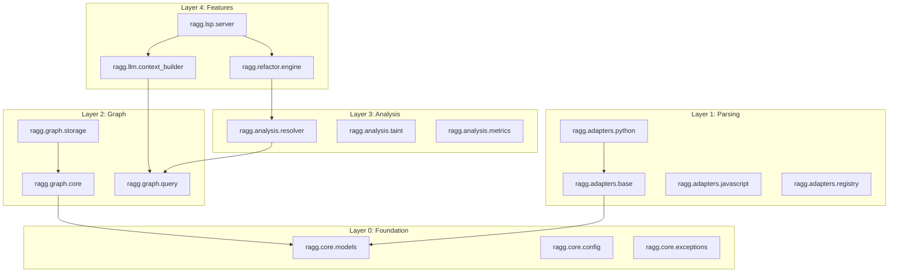

# RAGG Debugger - Low-Level Design Document (LLD)

**Version:** 1.0  
**Document Type:** Low-Level Design (LLD)  
**Project:** Language-Agnostic Code Intelligence Engine  
**Date:** 2026-01-18

---

## Table of Contents

1. [Module Specifications](#1-module-specifications)
2. [Class & Interface Definitions](#2-class--interface-definitions)
3. [Database Schemas](#3-database-schemas)
4. [API Contracts](#4-api-contracts)
5. [Algorithm Specifications](#5-algorithm-specifications)
6. [Error Handling](#6-error-handling)
7. [Performance Optimizations](#7-performance-optimizations)
8. [Testing Strategy](#8-testing-strategy)

---

## 1. Module Specifications

### 1.1 Module Dependency Graph



### 1.2 Package Structure

```
ragg/
├── __init__.py
├── core/
│   ├── __init__.py
│   ├── models.py          # UIRNode, UIREdge, TextRange
│   ├── config.py          # Configuration management
│   ├── exceptions.py      # Custom exception hierarchy
│   └── constants.py       # Enums: NodeKind, EdgeKind
├── adapters/
│   ├── __init__.py
│   ├── base.py            # LanguageAdapter protocol
│   ├── registry.py        # Adapter discovery & registration
│   ├── python_adapter.py  # Python-specific implementation
│   ├── js_adapter.py      # JavaScript/TypeScript
│   └── queries/           # Tree-sitter .scm files
│       ├── python/
│       │   ├── tags.scm
│       │   └── locals.scm
│       └── javascript/
├── graph/
│   ├── __init__.py
│   ├── core.py            # SemanticGraph main class
│   ├── partitions.py      # SCG, DDG, ImportGraph
│   ├── storage.py         # Persistence layer
│   └── query.py           # Graph query DSL
├── analysis/
│   ├── __init__.py
│   ├── resolver.py        # Symbol resolution
│   ├── taint.py           # Taint/impact analysis
│   └── metrics.py         # Complexity calculations
├── refactor/
│   ├── __init__.py
│   ├── engine.py          # Refactoring orchestrator
│   ├── validators.py      # Safety validators
│   └── patches.py         # Diff/patch generation
├── llm/
│   ├── __init__.py
│   ├── context_builder.py # Semantic slicing
│   ├── prompt_templates.py
│   └── clients.py         # LLM API clients
├── lsp/
│   ├── __init__.py
│   ├── server.py          # LSP protocol handler
│   └── handlers.py        # Method implementations
├── watcher/
│   ├── __init__.py
│   └── fs_watcher.py      # File system monitor
└── cli/
    ├── __init__.py
    └── main.py            # CLI entry point
```

---

## 2. Class & Interface Definitions

### 2.1 Core Models

```python
# ragg/core/models.py
from dataclasses import dataclass
from enum import Enum, auto
from typing import Optional

class NodeKind(Enum):
    FUNCTION = auto()
    CLASS = auto()
    METHOD = auto()
    VARIABLE = auto()
    PARAMETER = auto()
    INTERFACE = auto()
    MODULE = auto()
    IMPORT = auto()
    CONSTANT = auto()
    TYPE_ALIAS = auto()

class EdgeKind(Enum):
    CALLS = auto()           # Function invocation
    IMPORTS = auto()         # Module import
    DEFINES = auto()         # Symbol definition
    USES = auto()            # Symbol reference
    INHERITS = auto()        # Class inheritance
    IMPLEMENTS = auto()      # Interface implementation
    CONTAINS = auto()        # Structural containment
    DATA_FLOW = auto()       # Variable assignment chain
    TYPE_OF = auto()         # Type annotation

@dataclass(frozen=True, slots=True)
class TextRange:
    start_line: int
    start_col: int
    end_line: int
    end_col: int

    def contains(self, line: int, col: int) -> bool:
        if line < self.start_line or line > self.end_line:
            return False
        if line == self.start_line and col < self.start_col:
            return False
        if line == self.end_line and col > self.end_col:
            return False
        return True

@dataclass(slots=True)
class UIRNode:
    id: str                      # SHA256 hash of signature
    file_path: str               # Absolute path
    kind: NodeKind
    name: str
    type_sig: Optional[str]      # Normalized type signature
    range: TextRange
    docstring: Optional[str]
    is_exported: bool
    parent_id: Optional[str]     # Containing scope
    metadata: dict               # Language-specific extras

    @property
    def qualified_name(self) -> str:
        """Return fully qualified name including module path."""
        ...

@dataclass(slots=True)
class UIREdge:
    src_id: str
    dst_id: str
    kind: EdgeKind
    weight: float = 1.0
    metadata: dict = None

    @property
    def id(self) -> str:
        """Composite key for edge deduplication."""
        return f"{self.src_id}:{self.dst_id}:{self.kind.name}"
```

### 2.2 Adapter Protocol

```python
# ragg/adapters/base.py
from typing import Protocol, Iterator
from tree_sitter import Tree

class LanguageAdapter(Protocol):
    """
    Stateless transformer: converts source to UIR stream.
    Each adapter handles one language family.
    """

    @property
    def language_id(self) -> str:
        """Unique identifier: 'python', 'javascript', etc."""
        ...

    @property
    def file_extensions(self) -> tuple[str, ...]:
        """Supported extensions: ('.py',) or ('.js', '.jsx', '.ts')"""
        ...

    def parse(self, content: bytes, file_path: str) -> Tree:
        """Parse source into Tree-sitter CST."""
        ...

    def extract(self, tree: Tree, source: bytes) -> Iterator[UIRNode | UIREdge]:
        """Extract UIR elements from parsed tree."""
        ...

    def get_query_files(self) -> dict[str, str]:
        """Return paths to tags.scm, locals.scm query files."""
        ...

    def supports_incremental(self) -> bool:
        """Whether adapter supports incremental re-parsing."""
        return True
```

### 2.3 Graph Core

```python
# ragg/graph/core.py
from typing import Iterator, Optional, Set
from contextlib import contextmanager

class SemanticGraph:
    """
    Central knowledge graph managing all UIR nodes and edges.
    Thread-safe for concurrent read, exclusive write.
    """

    def __init__(self, storage_path: str, config: GraphConfig):
        self._storage = GraphStorage(storage_path)
        self._graph = nx.MultiDiGraph()
        self._lock = RWLock()
        self._dirty_files: Set[str] = set()

    # === CRUD Operations ===

    def upsert_node(self, node: UIRNode) -> None:
        """Insert or update a node, updating indexes."""
        ...

    def upsert_edge(self, edge: UIREdge) -> None:
        """Insert or update an edge with deduplication."""
        ...

    def remove_file(self, file_path: str) -> int:
        """Remove all nodes/edges for a file. Returns count."""
        ...

    # === Query Operations ===

    def get_node(self, node_id: str) -> Optional[UIRNode]:
        """Retrieve node by ID."""
        ...

    def find_nodes(self,
                   kind: Optional[NodeKind] = None,
                   name_pattern: Optional[str] = None,
                   file_path: Optional[str] = None) -> Iterator[UIRNode]:
        """Query nodes with filters."""
        ...

    def get_incoming_edges(self, node_id: str,
                          kind: Optional[EdgeKind] = None) -> Iterator[UIREdge]:
        """Get all edges pointing to this node."""
        ...

    def get_outgoing_edges(self, node_id: str,
                          kind: Optional[EdgeKind] = None) -> Iterator[UIREdge]:
        """Get all edges from this node."""
        ...

    # === Traversal ===

    def get_call_hierarchy(self, node_id: str,
                          direction: str = 'outgoing',
                          max_depth: int = 5) -> CallHierarchy:
        """Build call tree from a function node."""
        ...

    def get_impact_set(self, node_id: str,
                       max_depth: int = 3) -> Set[str]:
        """Forward traversal to find affected nodes."""
        ...

    # === Transactions ===

    @contextmanager
    def transaction(self):
        """Batch operations with atomic commit/rollback."""
        ...

    def persist(self) -> None:
        """Flush in-memory changes to storage."""
        ...
```

---

## 3. Database Schemas

### 3.1 SQLite Schema

```sql
-- ragg/schema.sql

-- Core tables
CREATE TABLE IF NOT EXISTS nodes (
    id TEXT PRIMARY KEY,
    file_path TEXT NOT NULL,
    kind TEXT NOT NULL,
    name TEXT NOT NULL,
    type_sig TEXT,
    start_line INTEGER NOT NULL,
    start_col INTEGER NOT NULL,
    end_line INTEGER NOT NULL,
    end_col INTEGER NOT NULL,
    docstring TEXT,
    is_exported INTEGER DEFAULT 0,
    parent_id TEXT,
    metadata TEXT,  -- JSON
    created_at TEXT DEFAULT CURRENT_TIMESTAMP,
    updated_at TEXT DEFAULT CURRENT_TIMESTAMP,

    FOREIGN KEY (parent_id) REFERENCES nodes(id) ON DELETE SET NULL
);

CREATE TABLE IF NOT EXISTS edges (
    id TEXT PRIMARY KEY,  -- Composite: src:dst:kind
    src_id TEXT NOT NULL,
    dst_id TEXT NOT NULL,
    kind TEXT NOT NULL,
    weight REAL DEFAULT 1.0,
    metadata TEXT,  -- JSON
    created_at TEXT DEFAULT CURRENT_TIMESTAMP,

    FOREIGN KEY (src_id) REFERENCES nodes(id) ON DELETE CASCADE,
    FOREIGN KEY (dst_id) REFERENCES nodes(id) ON DELETE CASCADE
);

CREATE TABLE IF NOT EXISTS files (
    path TEXT PRIMARY KEY,
    content_hash TEXT NOT NULL,
    language_id TEXT NOT NULL,
    line_count INTEGER NOT NULL,
    last_indexed TEXT DEFAULT CURRENT_TIMESTAMP
);

-- Performance indexes
CREATE INDEX IF NOT EXISTS idx_nodes_file ON nodes(file_path);
CREATE INDEX IF NOT EXISTS idx_nodes_kind ON nodes(kind);
CREATE INDEX IF NOT EXISTS idx_nodes_name ON nodes(name);
CREATE INDEX IF NOT EXISTS idx_nodes_parent ON nodes(parent_id);
CREATE INDEX IF NOT EXISTS idx_edges_src ON edges(src_id);
CREATE INDEX IF NOT EXISTS idx_edges_dst ON edges(dst_id);
CREATE INDEX IF NOT EXISTS idx_edges_kind ON edges(kind);

-- Full-text search for symbol names
CREATE VIRTUAL TABLE IF NOT EXISTS nodes_fts USING fts5(
    name,
    docstring,
    content='nodes',
    content_rowid='rowid'
);

-- Triggers to maintain FTS index
CREATE TRIGGER nodes_ai AFTER INSERT ON nodes BEGIN
    INSERT INTO nodes_fts(rowid, name, docstring)
    VALUES (new.rowid, new.name, new.docstring);
END;

CREATE TRIGGER nodes_ad AFTER DELETE ON nodes BEGIN
    INSERT INTO nodes_fts(nodes_fts, rowid, name, docstring)
    VALUES('delete', old.rowid, old.name, old.docstring);
END;
```

### 3.2 Vector Store Schema (ChromaDB)

```python
# ragg/graph/embeddings.py

COLLECTION_CONFIG = {
    "name": "code_embeddings",
    "metadata": {
        "hnsw:space": "cosine",
        "hnsw:M": 16,
        "hnsw:construction_ef": 100,
    }
}

# Document structure stored in ChromaDB
# Each document = one UIRNode that is embeddable (functions, classes)
DOCUMENT_SCHEMA = {
    "id": str,              # Same as UIRNode.id
    "embedding": list,      # 768-dim vector from code-bert
    "document": str,        # Source code text
    "metadata": {
        "file_path": str,
        "kind": str,
        "name": str,
        "start_line": int,
        "end_line": int,
        "language": str,
    }
}
```

---

## 4. API Contracts

### 4.1 LSP Method Handlers

```python
# ragg/lsp/handlers.py

@dataclass
class DefinitionParams:
    text_document: TextDocumentIdentifier
    position: Position

@dataclass
class DefinitionResult:
    uri: str
    range: Range

async def handle_definition(params: DefinitionParams) -> list[DefinitionResult]:
    """
    textDocument/definition

    1. Find node at position in text_document
    2. Query graph for DEFINES edge pointing to this node
    3. Return location of definition node
    """
    ...

async def handle_references(params: ReferenceParams) -> list[Location]:
    """
    textDocument/references

    1. Find definition node at position
    2. Query graph for all incoming USES edges
    3. Return locations of all reference sites
    """
    ...

async def handle_rename(params: RenameParams) -> WorkspaceEdit:
    """
    textDocument/rename

    1. Find symbol at position
    2. Call RefactoringEngine.rename()
    3. Convert patches to WorkspaceEdit
    4. Return edits (or error if unsafe)
    """
    ...

async def handle_hover(params: HoverParams) -> Hover:
    """
    textDocument/hover

    1. Find node at position
    2. Build hover content: type_sig + docstring
    3. Optionally: request LLM summary if complex
    """
    ...
```

### 4.2 CLI Command Interface

```python
# ragg/cli/main.py
import click

@click.group()
@click.option('--config', type=click.Path(), help='Config file path')
@click.pass_context
def cli(ctx, config):
    """RAGG Debugger - Code Intelligence Engine"""
    ctx.ensure_object(dict)
    ctx.obj['config'] = load_config(config)

@cli.command()
@click.argument('path', type=click.Path(exists=True))
@click.option('--incremental/--full', default=True)
def index(path: str, incremental: bool):
    """
    Build or update the code index.

    Examples:
        codemap index .
        codemap index ./src --full
    """
    ...

@cli.command()
@click.argument('query')
def query(query: str):
    """
    Run SQL-like query over codebase.

    Examples:
        codemap query "SELECT name FROM functions WHERE complexity > 10"
        codemap query "SELECT * FROM edges WHERE kind = 'CALLS'"
    """
    ...

@cli.command()
@click.argument('symbol')
@click.option('--provider', default='ollama', help='LLM provider')
def explain(symbol: str, provider: str):
    """
    Generate LLM explanation for a symbol.

    Examples:
        codemap explain calculate_velocity
        codemap explain MyClass.process --provider openai
    """
    ...

@cli.command()
@click.argument('symbol')
@click.argument('new_name')
@click.option('--dry-run', is_flag=True)
def rename(symbol: str, new_name: str, dry_run: bool):
    """
    Safely rename a symbol across the codebase.

    Examples:
        codemap rename old_func new_func --dry-run
        codemap rename MyClass.method better_name
    """
    ...
```

---

## 5. Algorithm Specifications

### 5.1 Symbol Resolution Algorithm

```python
# ragg/analysis/resolver.py

class SymbolResolver:
    """
    Resolves unresolved symbol references to their definitions.
    Uses lexical scoping rules with fallback chain.
    """

    def resolve(self, reference_node: UIRNode) -> Optional[UIRNode]:
        """
        Resolution order:
        1. Local scope (same function/block)
        2. Enclosing scopes (parent functions/classes)
        3. Module scope (file-level definitions)
        4. Imported symbols
        5. Built-in symbols
        """
        symbol_name = reference_node.name

        # 1. Local scope
        if definition := self._find_in_scope(reference_node.parent_id, symbol_name):
            return definition

        # 2. Walk up scope chain
        current_scope = reference_node.parent_id
        while current_scope:
            parent = self._graph.get_node(current_scope)
            if parent and (defn := self._find_in_scope(parent.parent_id, symbol_name)):
                return defn
            current_scope = parent.parent_id if parent else None

        # 3. Module scope
        if definition := self._find_in_file(reference_node.file_path, symbol_name):
            return definition

        # 4. Imported symbols
        if definition := self._find_in_imports(reference_node.file_path, symbol_name):
            return definition

        # 5. Built-ins (language-specific)
        return self._builtins.get(symbol_name)
```

### 5.2 Semantic Slice Algorithm (LLM Context)

```python
# ragg/llm/context_builder.py

class ContextBuilder:
    """
    Builds optimized context for LLM consumption.
    Goal: Maximum semantic information within token budget.
    """

    def build_slice(self,
                    target_symbol: str,
                    token_budget: int = 8000) -> ContextSlice:
        """
        Algorithm: "Semantic Slice"

        Priority order for context inclusion:
        1. Core    - Target function/class code (REQUIRED)
        2. 1-hop   - Signatures of called functions (HIGH)
        3. Refs    - 3-5 usage examples (MEDIUM)
        4. Types   - Custom type definitions (MEDIUM)
        5. Similar - Vector-search related code (LOW)
        """
        target = self._graph.find_by_name(target_symbol)
        if not target:
            raise SymbolNotFound(target_symbol)

        slice_items: list[SliceItem] = []
        remaining_tokens = token_budget

        # 1. Core (always include)
        core_code = self._get_source(target)
        core_tokens = self._count_tokens(core_code)
        slice_items.append(SliceItem(
            category='core',
            node=target,
            content=core_code,
            tokens=core_tokens
        ))
        remaining_tokens -= core_tokens

        # 2. Called functions (signatures + docstrings)
        for edge in self._graph.get_outgoing_edges(target.id, EdgeKind.CALLS):
            called = self._graph.get_node(edge.dst_id)
            sig = self._get_signature(called)
            sig_tokens = self._count_tokens(sig)
            if sig_tokens <= remaining_tokens:
                slice_items.append(SliceItem('dependency', called, sig, sig_tokens))
                remaining_tokens -= sig_tokens

        # 3. Usage examples (top 5 by diversity)
        usages = self._get_diverse_usages(target.id, limit=5)
        for usage in usages:
            snippet = self._get_context_snippet(usage, lines=5)
            snippet_tokens = self._count_tokens(snippet)
            if snippet_tokens <= remaining_tokens:
                slice_items.append(SliceItem('usage', usage, snippet, snippet_tokens))
                remaining_tokens -= snippet_tokens

        # 4. Type definitions
        for type_node in self._get_referenced_types(target):
            type_def = self._get_source(type_node)
            type_tokens = self._count_tokens(type_def)
            if type_tokens <= remaining_tokens:
                slice_items.append(SliceItem('type', type_node, type_def, type_tokens))
                remaining_tokens -= type_tokens

        # 5. Semantically similar (vector search)
        if remaining_tokens > 500:
            similar = self._vector_search(target, limit=3)
            for node, score in similar:
                similar_code = self._get_source(node)
                similar_tokens = self._count_tokens(similar_code)
                if similar_tokens <= remaining_tokens:
                    slice_items.append(SliceItem('similar', node, similar_code, similar_tokens))
                    remaining_tokens -= similar_tokens

        return ContextSlice(
            target=target,
            items=slice_items,
            total_tokens=token_budget - remaining_tokens
        )
```

### 5.3 Incremental Update Algorithm

```python
# ragg/watcher/incremental.py

class IncrementalProcessor:
    """
    Efficient delta processing for file changes.
    Only re-parses changed files and updates affected subgraphs.
    """

    def process_changes(self,
                        changed: list[str],
                        added: list[str],
                        deleted: list[str]) -> UpdateStats:
        """
        Pipeline:
        1. Remove nodes/edges for deleted + changed files
        2. Parse added + changed files
        3. Upsert new UIR
        4. Re-link phase: update cross-file references
        """
        stats = UpdateStats()

        with self._graph.transaction():
            # Phase 1: Cleanup
            for path in deleted + changed:
                count = self._graph.remove_file(path)
                stats.nodes_removed += count

            # Phase 2: Re-parse
            for path in added + changed:
                adapter = self._registry.get_adapter(path)
                if not adapter:
                    continue

                content = Path(path).read_bytes()
                tree = adapter.parse(content, path)

                for item in adapter.extract(tree, content):
                    if isinstance(item, UIRNode):
                        self._graph.upsert_node(item)
                        stats.nodes_added += 1
                    else:
                        self._graph.upsert_edge(item)
                        stats.edges_added += 1

            # Phase 3: Re-link affected
            affected_symbols = self._find_affected_symbols(changed + added)
            for symbol_id in affected_symbols:
                self._resolver.relink(symbol_id)
                stats.relinked += 1

        return stats
```

---

## 6. Error Handling

### 6.1 Exception Hierarchy

```python
# ragg/core/exceptions.py

class RAGGError(Exception):
    """Base exception for all RAGG errors."""
    pass

class ParseError(RAGGError):
    """Failed to parse source file."""
    def __init__(self, file_path: str, line: int, message: str):
        self.file_path = file_path
        self.line = line
        super().__init__(f"{file_path}:{line}: {message}")

class AdapterNotFoundError(RAGGError):
    """No adapter registered for file extension."""
    pass

class SymbolNotFoundError(RAGGError):
    """Symbol not found in graph."""
    pass

class RefactoringError(RAGGError):
    """Base for refactoring failures."""
    pass

class CollisionError(RefactoringError):
    """Rename would cause name collision."""
    def __init__(self, symbol: str, conflicting_scope: str):
        super().__init__(
            f"Cannot rename to '{symbol}': already defined in {conflicting_scope}"
        )

class ShadowingError(RefactoringError):
    """Rename would cause shadowing."""
    pass

class StorageError(RAGGError):
    """Database or file system error."""
    pass

class LLMError(RAGGError):
    """LLM provider error."""
    pass
```

### 6.2 Recovery Strategies

| Error Type             | Recovery Strategy                    | User Impact       |
| ---------------------- | ------------------------------------ | ----------------- |
| `ParseError`           | Skip function, continue file parsing | Partial index     |
| `AdapterNotFoundError` | Log warning, skip file               | File excluded     |
| `StorageError`         | Retry with backoff, then rebuild     | Possible re-index |
| `LLMError`             | Fallback to cached/static response   | Degraded feature  |
| `CollisionError`       | Return detailed error to user        | Operation aborted |

---

## 7. Performance Optimizations

### 7.1 Caching Strategy

```python
# ragg/core/cache.py

class CacheManager:
    """Multi-tier caching for performance optimization."""

    # L1: In-memory LRU for hot nodes
    _node_cache: LRUCache[str, UIRNode]        # Max 10,000 entries

    # L2: Query result cache
    _query_cache: TTLCache[str, QueryResult]   # TTL: 60 seconds

    # L3: Embedding cache
    _embedding_cache: LRUCache[str, np.ndarray] # Max 5,000 entries

    # L4: Parse tree cache (for incremental parsing)
    _tree_cache: LRUCache[str, Tree]            # Max 100 entries
```

### 7.2 Performance Targets by Operation

| Operation          | Target Latency | Strategy                  |
| ------------------ | -------------- | ------------------------- |
| Node lookup by ID  | < 1ms          | L1 cache + SQLite index   |
| Find references    | < 50ms         | Pre-computed edge indexes |
| Full-text search   | < 100ms        | FTS5 virtual table        |
| Vector search      | < 200ms        | HNSW index in ChromaDB    |
| Incremental update | < 2s           | Delta processing          |
| Full re-index      | < 30s/100k LOC | Parallel adapter pool     |

### 7.3 Concurrency Model

```python
# Threading model
"""
┌─────────────────────────────────────────────┐
│               Main Thread                    │
│  - LSP message handling                      │
│  - CLI command dispatch                      │
└─────────────────────────────────────────────┘
              │
    ┌─────────┴─────────┐
    ▼                   ▼
┌───────────┐     ┌───────────┐
│ Parser    │     │ Analyzer  │
│ Thread    │     │ Thread    │
│ Pool (4)  │     │ Pool (2)  │
└───────────┘     └───────────┘
    │                   │
    └─────────┬─────────┘
              ▼
    ┌───────────────────┐
    │   Graph Core      │
    │ (RWLock protected)│
    └───────────────────┘
"""
```

---

## 8. Testing Strategy

### 8.1 Test Categories

```
tests/
├── unit/
│   ├── test_models.py          # UIRNode, UIREdge
│   ├── test_adapters.py        # Individual adapters
│   └── test_resolver.py        # Symbol resolution
├── integration/
│   ├── test_graph_storage.py   # Graph + SQLite
│   ├── test_lsp_server.py      # Full LSP flow
│   └── test_refactoring.py     # End-to-end refactor
├── fixtures/
│   ├── python/                 # Sample Python projects
│   ├── javascript/             # Sample JS projects
│   └── mixed/                  # Multi-language projects
└── performance/
    ├── bench_indexing.py       # Indexing speed
    └── bench_queries.py        # Query latency
```

### 8.2 Test Commands

```bash
# Unit tests
pytest tests/unit -v

# Integration tests
pytest tests/integration -v

# Performance benchmarks
pytest tests/performance --benchmark-only

# Coverage report
pytest --cov=ragg --cov-report=html
```

---

## Appendix: Implementation Checklist

### Phase 1: Skeleton (Weeks 1-4)

- [ ] Core models: `UIRNode`, `UIREdge`, `TextRange`
- [ ] Python adapter with Tree-sitter
- [ ] SQLite storage layer
- [ ] Basic CLI: `index` command

### Phase 2: Graph (Weeks 5-8)

- [ ] Symbol resolution
- [ ] Call graph construction
- [ ] Reference finding
- [ ] CLI: `query` command

### Phase 3: LLM & Refactor (Weeks 9-12)

- [ ] Context builder with semantic slicing
- [ ] LLM client integration
- [ ] Rename refactoring with safety checks
- [ ] LSP server implementation

---

> [!IMPORTANT]
> This LLD is a living document. Update as implementation progresses and design decisions evolve.

**Companion Document:** [RAGG_Debugger_HLD.md](file:///home/sabawi/Development/RAICA/RAGG_Debugger_HLD.md)
